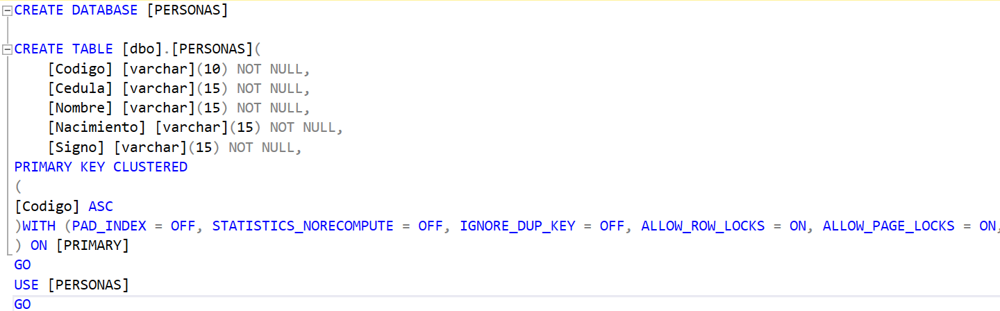

# CorreccionPrueba2Bimestre
## Detalle de elaboración del programa
### 1. Desarrollo de la interfaz gráfica
|Creación de ventanas con Java Swing|
|-|
||
|Gracias a este se construyen los elementos gráficos que va a interactuar con el código, el cual permitirá la realización de consultas con la base de datos|
### 2. Creación de la Base de Datos en SQL Server Managament
| Base de Datos: Personas                                                                     |
|---------------------------------------------------------------------------------------------|
|                                                                          |
| esto se realiza con el fin de poder realizar el CRUD de los datos en la tabla: **personas** |

