# CorreccionPrueba2Bimestre
## Detalle de elaboración del programa
### 1. Desarrollo de la interfaz gráfica
|Creación de ventanas con Java Swing|
|-|
||
|Gracias a este se construyen los elementos gráficos que va a interactuar con el código, el cual permitirá la realización de consultas con la base de datos|
### 2. Creación de la Base de Datos en SQL Server Managament
| Base de Datos: Personas                                                                                                                                                                                                                                                                                                                                                                                                                                                              |
|--------------------------------------------------------------------------------------------------------------------------------------------------------------------------------------------------------------------------------------------------------------------------------------------------------------------------------------------------------------------------------------------------------------------------------------------------------------------------------------|
| 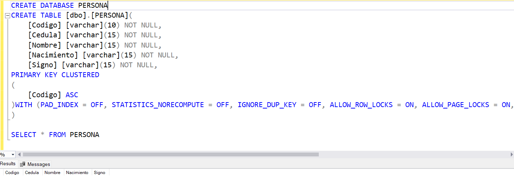                                                                                                                                                                                                                                                                                                                                                                                                                                                          |
| esto se realiza con el fin de poder realizar el CRUD de los datos en la tabla: **Persona**                                                                                                                                                                                                                                                                                                                                                                                           |
| **Nota:** es importante tener previamente creado un usuario con certificación SQL y en él generar la Base de Datos. Una forma es dándole al usuario en "server roles" el rol fijo de nivel de servidor: ***sysadmin*** para poder realizar cualquier actividad en el servidor y evitar la asignación de permisos específicos al usuario, no obstante, lo idóneo es que el administrador del sistema asigne una base de datos al usuario y le otorgue y deniegue permisos específicos |
| 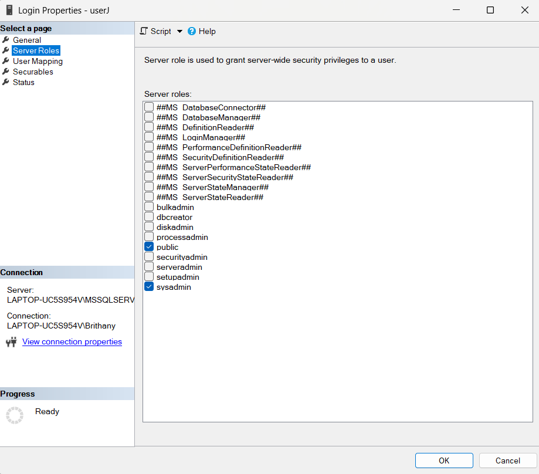                                                                                                                                                                                                                                                                                                                                                                                                                                                          |
| 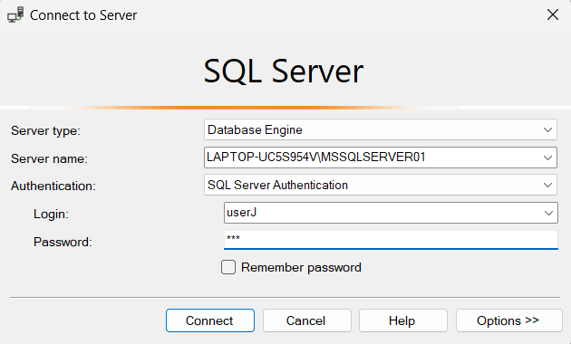                                                                                                                                                                                                                                                                                                                                                                                                                                                              |

### 3. Configuraciones Previas en el Motor de la Base de Datos
| Habilitar conexiones TCP/IP y "Named Pipes" al servidor SQL |
|------------------------------------------------------------|
||

| Usar el puerto correcto                                                                                                                                                                                                                                                                                                                                                                        |
|------------------------------------------------------------------------------------------------------------------------------------------------------------------------------------------------------------------------------------------------------------------------------------------------------------------------------------------------------------------------------------------------|
| 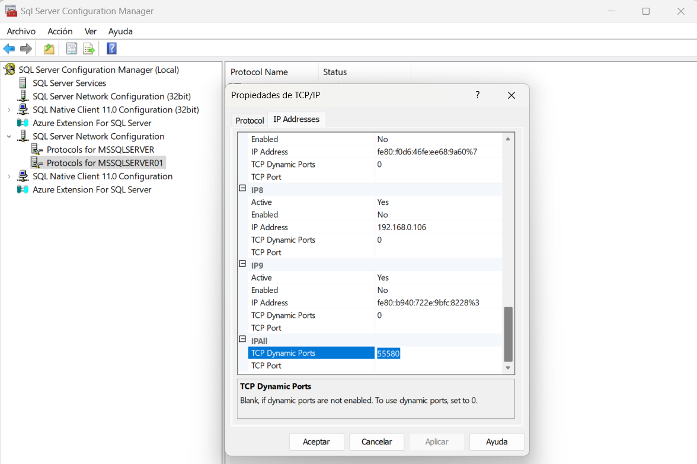                                                                                                                                                                                                                                                                                                                                                                        |
| Lo usual es usar el puerto 1433, asignando a los puertos TCP y a los puertos dinámicos TCP el puerto 1433 de la respectiva dirección IP y luego reinicia el servidor. Sin embargo, Si no hay puertos asignados a IP1, IP2, etc se debe usar el que está en la opción "IPALL" que se encuentra haciendo scrolling más abajo de "Propiedades: TCP/IP" En este caso el puerto es: ***55580*** |

### 4. Añadir controlador JDBC para MS SQL Server en el proyecto
| JDBC Driver de Microsoft para SQL Server |
|-----------------------------------------|
| 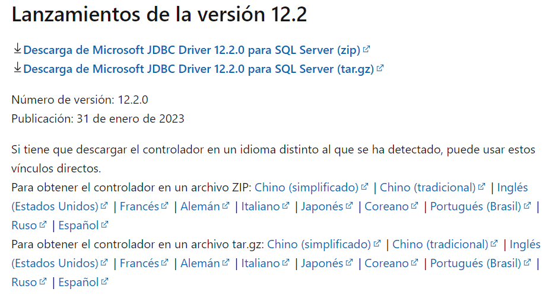                 |
| Añadirlo a librerías                    |
|                                          |

### 5. Conexión a la base de Datos
| Generar la cadena de conexión                                                                                                                                                                                                                                 |
|---------------------------------------------------------------------------------------------------------------------------------------------------------------------------------------------------------------------------------------------------------------|
| **Comprobación de la conexión**                                                                                                                                                                                                                               |
|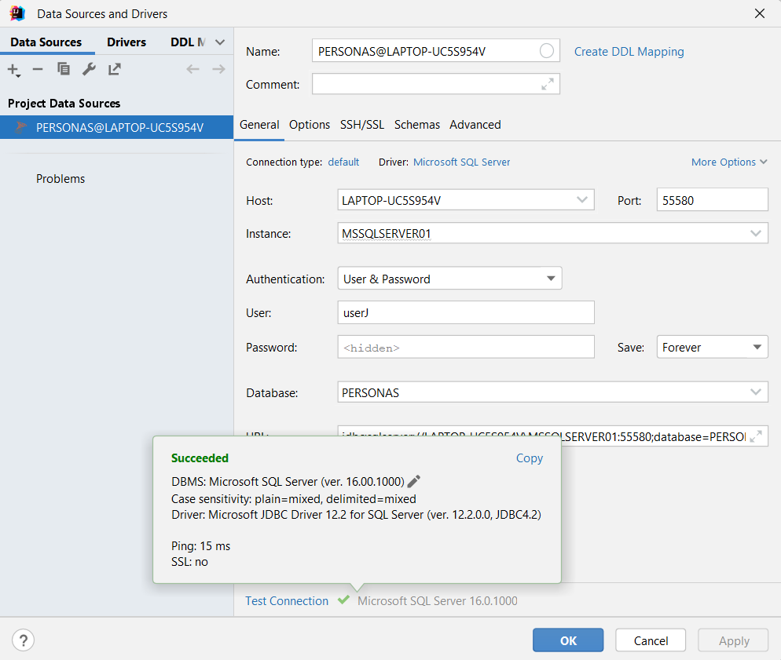|
| En ella se indica el servidor, la instancia, el número de puerto, el nombre de la base de datos y para evitar problemas de conexión segura se debe añadir el sufijo ***encrypt=true; trustServerCertificate=true;***                                          |
|                                                                                                                                                                                                                                    |
| **Uso de la clase Connection**: crear un objeto de la misma, este junto al *DriverManager* nos permitirá controlar la conexión. Al método *.getConnection* se le enviarán como argumentos la cadena de conexión, el usuario y contraseña creados previamente. |
| 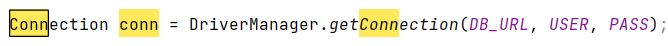                                                                                                                                                                                                                                   |

### 6. Inserción de Datos
| Añadir un evento al botón Ingresar                                                                                                              |
|-------------------------------------------------------------------------------------------------------------------------------------------------|
| Mediante un objeto de la clase PreparedStatement se ejecutará el query enviado como argumento del método preparedStatement del objeto conexión. |
|                                                                                                                          |
| **Prueba de la inserción de un registro en la tabla Persona**                                                                                   |
|                                                                                                                                                  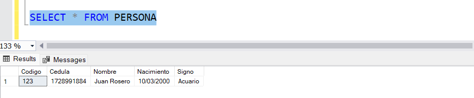|

### 7. Borrar Datos
| Añadir un evento al botón BorrarRegistro                                                                                             |
|--------------------------------------------------------------------------------------------------------------------------------------|
| Mediante un objeto de la clase Statement se ejecutará el query enviado como argumento del método executeUpdate del objeto statement. |
| 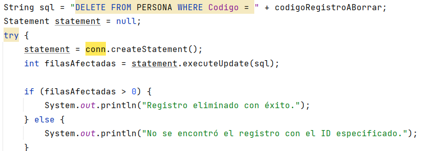                                                                                                            |
| **Prueba de eliminación de un Registro por medio del código**                                                                        |
| Tabla Persona antes del *Delete*                                                                                                     |
| 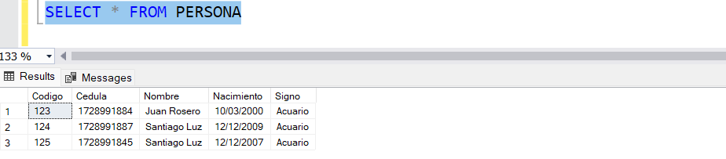                                                                                                            |
| Registro Eliminado                                                                                                                   |
| 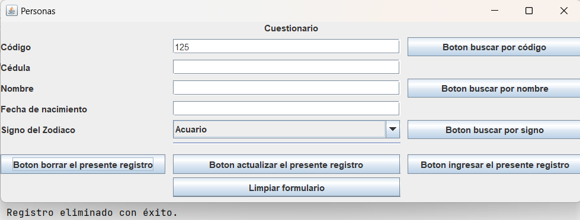 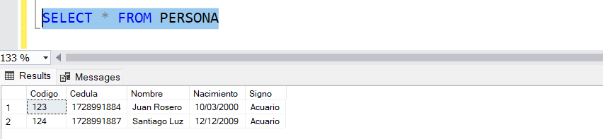                                                                                                            |                                                                                                            

### 8. Actualizar Registros
| Añadir un evento al Botón Actualizar                                                                                                            |
|-------------------------------------------------------------------------------------------------------------------------------------------------|
| Mediante un objeto de la clase PreparedStatement se ejecutará el query enviado como argumento del método preparedStatement del objeto conexión. |
| 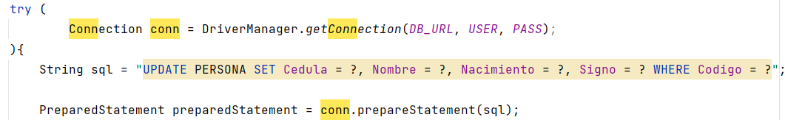                                                                                                                       |
| Tabla Persona antes del *Update*                                                                                                                |
| 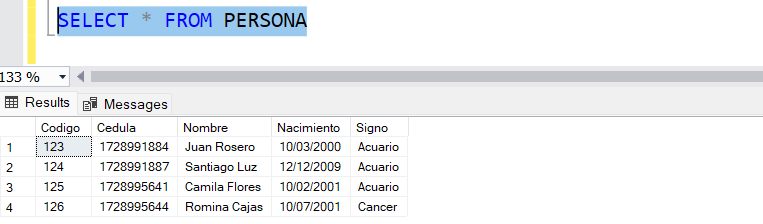                                                                                                                       |
| Registro Actualizado en función al código (pk de la Tabla Personas)                                                                             |
| 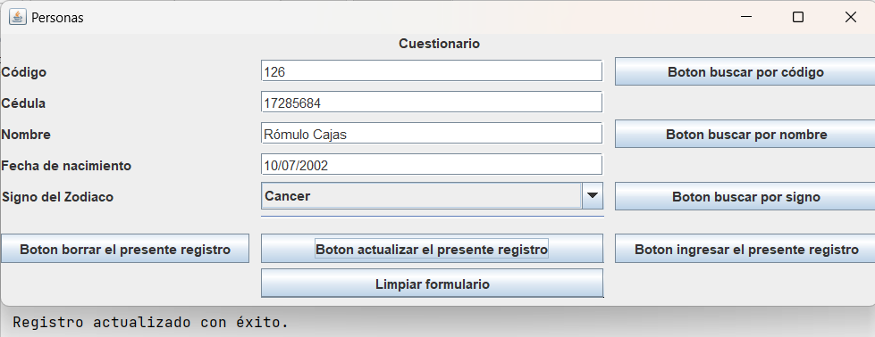                                                                                                                       |
| El registro cuyo código es 126 seteará los valores de cédula, nombre, Fecha Nacimiento y Signo                                                  |
| 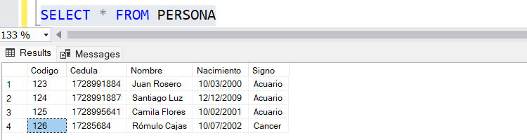                                                                                                                       |
| Si se intenta actualizar un registro por medio de un ID que no existe, se imprimirá en consola un mensaje                                       |
| 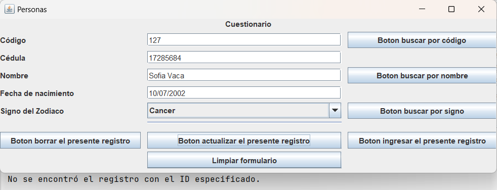                                                                                                                       |
| Lo anterior, se debe a que preparedStatement.executeQuery retorna un entero que ayudará a determinar si el registro se actualizó o no           |
|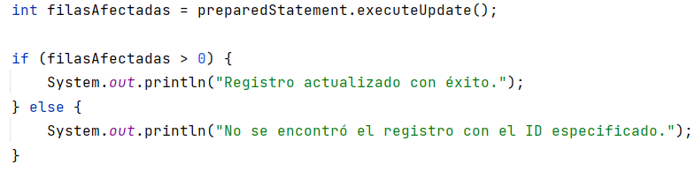|

### 9. Búsquedas (Select)
| Búsqueda por Código                                      |
|----------------------------------------------------------|
| Tabla Persona actualizada                                |
| 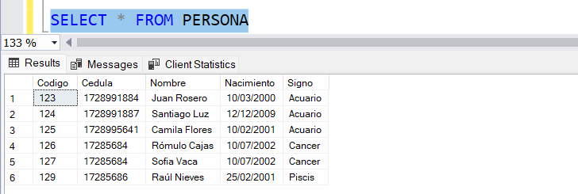                                |
| Resultado de la búsqueda                                 |
| 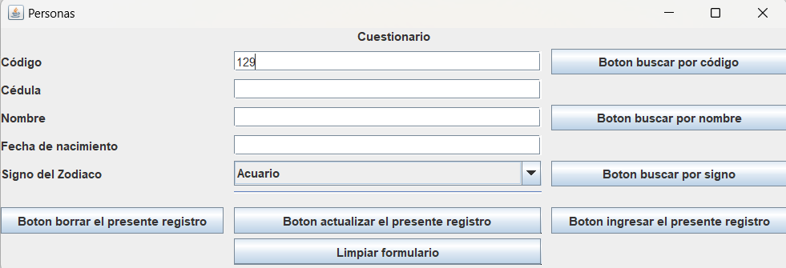 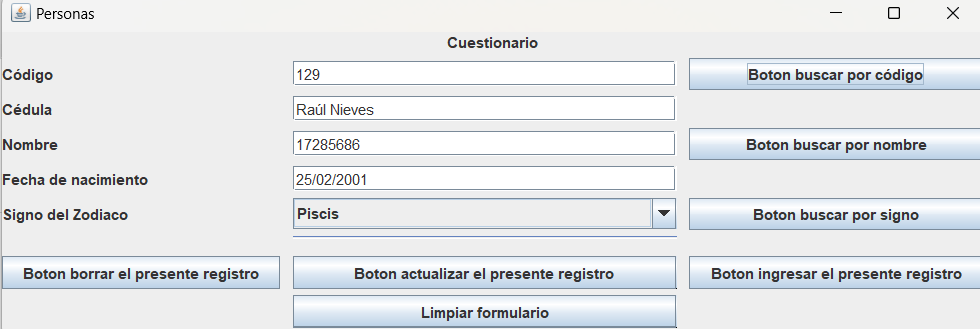  |

| Búsqueda por Nombre       |
|---------------------------|
| Antes                     |
| 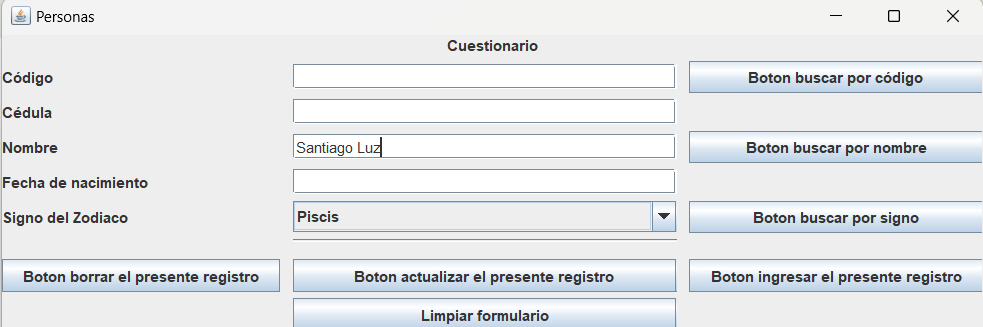 |
| Después                   |
|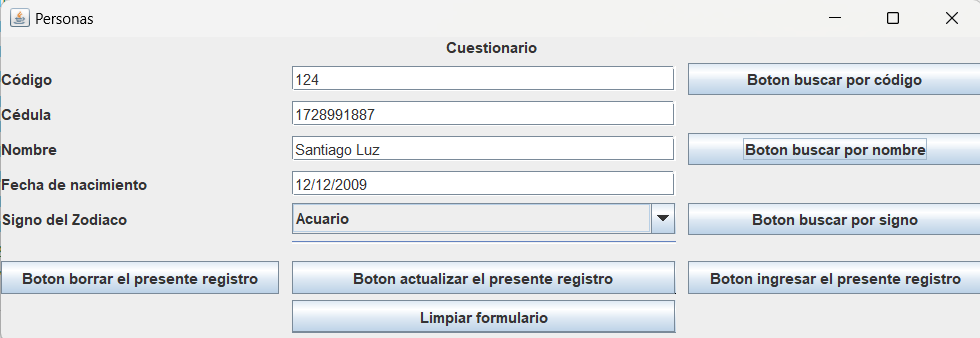|

| Búsqueda por Signo                                                                                                                                                                            |
|-----------------------------------------------------------------------------------------------------------------------------------------------------------------------------------------------|
| Tabla Persona Actualizada                                                                                                                                                                     |
| 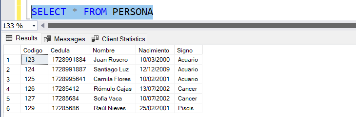                                                                                                                                                                     |
| Se realizará una búsqueda por el signo: *Cáncer* La primera incidencia que encuentre se mostrará en la interfaz, el resto registros que cumplan con la condición se mostrarán en consola. |
| 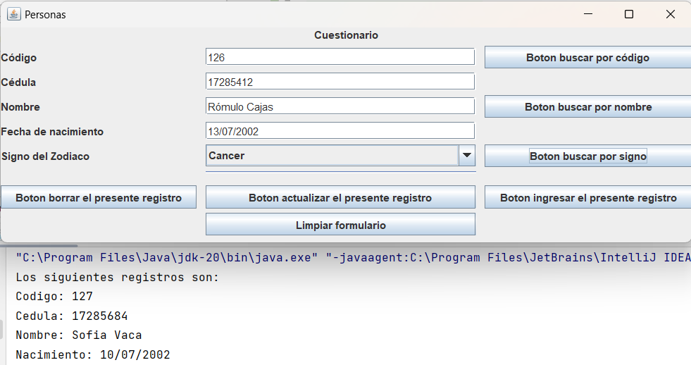 En el signo *Acuario* hay más de un registro con esa condición: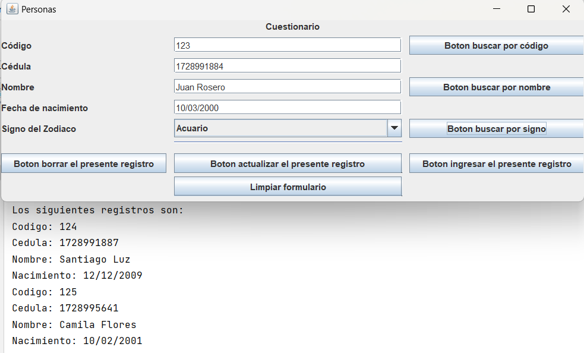                                                                        |

### 10. Diseño del Form
| Diseño Final                                                                                                           |
|------------------------------------------------------------------------------------------------------------------------|
|  |
